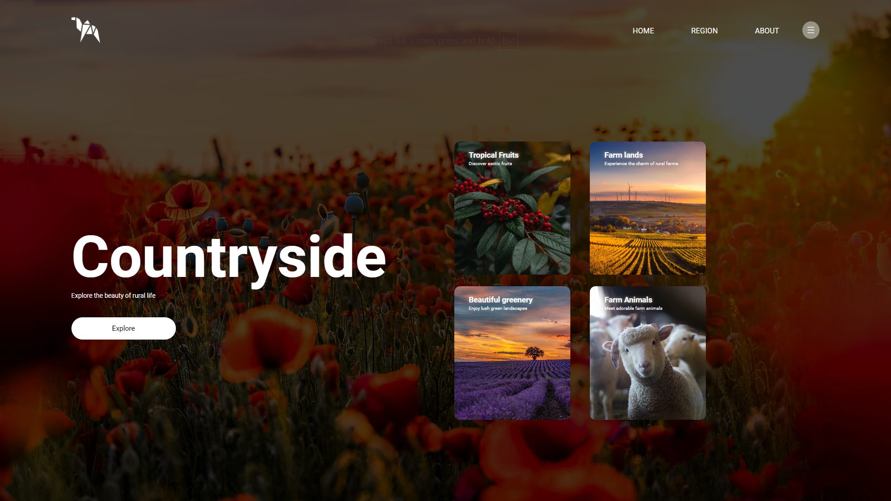

# 🏞️ Countryside Tourism Website

This is a **simple front-end website** designed to promote countryside tourism. It provides an engaging platform for users to explore the beauty of rural life through various sections, including information about tropical fruits, farms, greenery, and farm animals.

---

## 🌟 Features

- **Responsive Design** 📱: The website is optimized for various screen sizes, ensuring a great user experience on both desktop and mobile devices.
- **Navigation Menu** 🧭: Easy navigation through different sections such as Home, Region, and About.
- **Engaging Content** 🖼️: The website features cards that highlight various aspects of countryside tourism, including:
  - **Tropical Fruits** 🍍: Discover exotic fruits that thrive in rural areas.
  - **Farm Lands** 🚜: Experience the charm and tranquility of rural farms.
  - **Beautiful Greenery** 🌳: Enjoy stunning landscapes filled with lush greenery.
  - **Farm Animals** 🐄: Meet adorable animals commonly found in the countryside.

---

## 🛠️ Technologies Used

- **HTML**: The structure of the website is built using HTML5.
- **CSS**: Styling is applied through an external CSS stylesheet.
- **Fonts**: Utilizes Google Fonts for a modern typography look.

---

## 📸 Screenshots

### 1️⃣ Home Page

### 2️⃣ Region Section

### 3️⃣ About Page

---

## 🚀 Usage

To view the website, simply open the `index.html` file in a web browser. Explore the various sections to learn more about countryside tourism!

---

This project demonstrates basic front-end web development skills, including HTML and CSS, while emphasizing the beauty of countryside tourism.
